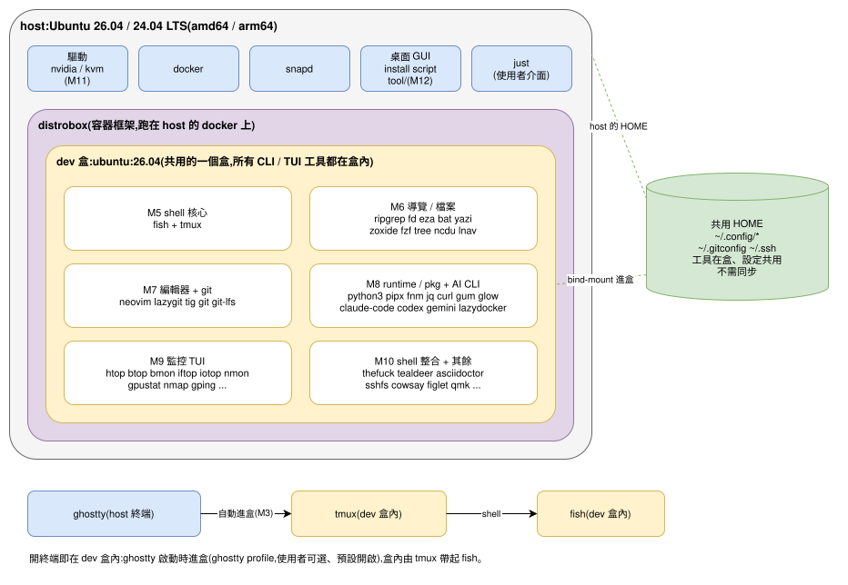
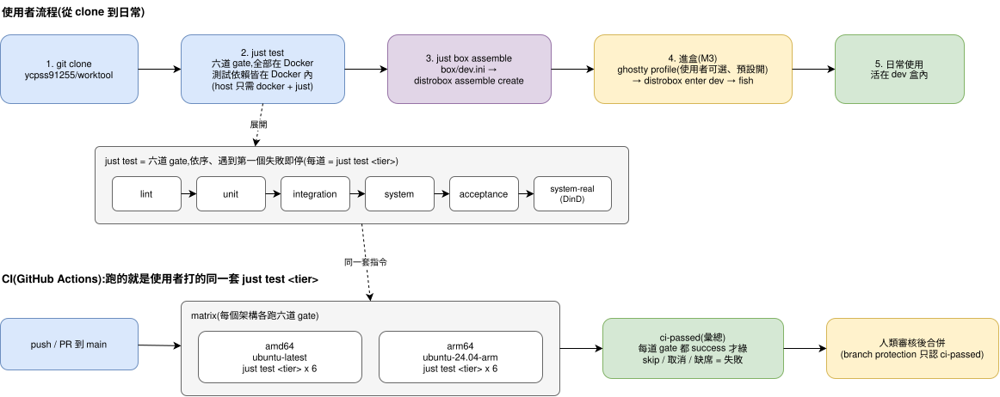
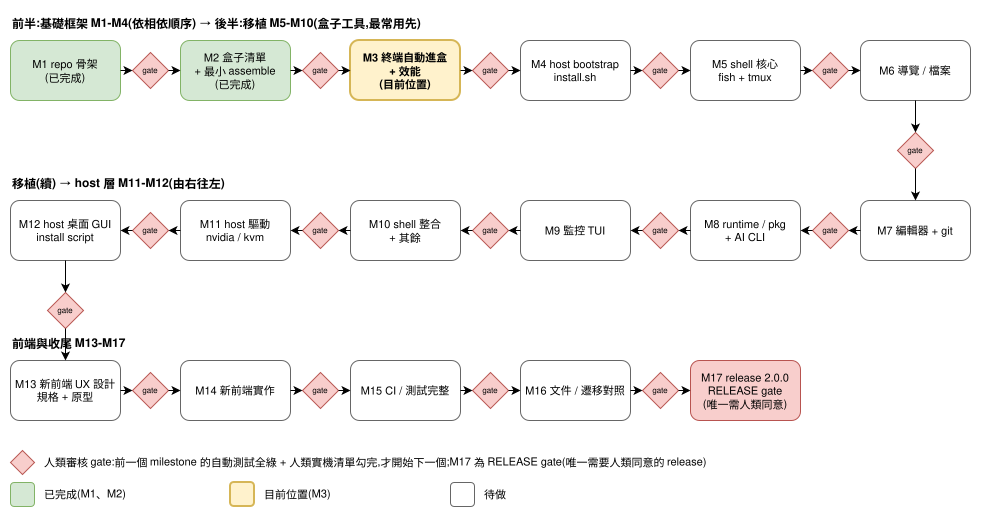

# worktool

以 distrobox 為基礎的開發環境。開發用的 CLI/TUI 工具全部住在一個共用的
distrobox「dev 盒」裡,使用者直接活在盒子內(終端自動進盒);host 只保留
驅動、docker、snapd、桌面 GUI app(以 install script 形式)與容器框架。設定檔
留在共用的 HOME。

這是 `init_ubuntu`(ycpss91255/initialization)的重設計繼任者,為新的大版本。

狀態:M2(盒子清單格式 + 最小 assemble)。設計與 milestone 計畫見
[`doc/design.md`](doc/design.md);清單格式、assemble 流程與從 clone 到 assemble
的完整驗證步驟見 [`doc/manifest.md`](doc/manifest.md);終端自動進盒的設定
(`just box setup` / `status` / `enter`)見 [`doc/enter.md`](doc/enter.md);目錄結構見
[`doc/structure.md`](doc/structure.md)。

## 架構與流程

三張圖都是可編輯的 draw.io 檔(`doc/diagram/*.drawio.svg`,圖與原始檔是同一個
檔案):點圖可在 app.diagrams.net 直接開啟編輯;VS Code 裝
`hediet.vscode-drawio`(`.vscode/extensions.json` 已推薦)即可就地編輯、存檔即同步。

### 架構

host 只留驅動、docker、snapd、桌面 GUI install script 與 `just`;distrobox 在 host 的
docker 上跑一個共用的 dev 盒(`ubuntu:26.04`),所有 CLI / TUI 工具(M5-M10)都在盒內;
盒子有自己的 HOME,user config 以 symlink 從 host 帶入(決策見
[ADR 0002](doc/adr/0002-box-owns-its-home.md),尚未實作,將由 #198、#199 實作);
終端 ghostty(host)-> `distrobox enter dev` -> 盒內 fish,不自動開 tmux(issue #179);
盒內自己開的 tmux 用盒子自己的 server(`TMUX_TMPDIR`),不會連到 host 的 tmux。盒內
目前的套件見 [`box/dev.ini`](box/dev.ini):M2 的 ripgrep、fzf,加上 M3 先裝的 tmux、
fish(設定留 M5)。

### 流程

clone -> `just test`(六道 gate,全部在 Docker)-> `just box assemble` -> 進盒
(ghostty profile,使用者可選、預設開)-> 日常使用;CI 以 amd64 / arm64 matrix 跑
同一套 `just test <tier>`,`ci-passed` 彙總。

### Milestone

M1-M17 依序、不可跨越,每個 milestone 之間有人類審核 gate;M1、M2 已完成,目前在 M3。

## 前置需求

- **docker**:目前使用者可直接執行(`docker run --rm hello-world` 能成功),
  不需要 `sudo`。
- **just**:使用者介面(下方)。M4 host bootstrap 起由 install script 一併安裝;
  在那之前請自行安裝。
- host **不需要** distrobox:測試用的 distrobox 已鎖定版本、烘進 Docker 測試映像;
  只有 `just box assemble` 在 host 上真的建盒時才需要。

## 使用方式

`just` 是 worktool 的使用者通用介面,命令模型比照 `ycpss91255-docker/base`
(ADR-00000005/10/11):零特例、每個動作都住在一個以動作命名的 namespace
(`just <namespace> <recipe> [選項]`),裸指令跑最大範圍、子 recipe 與選項只收窄,
justfile 只是薄轉發器,參數驗證與 `--help` 都在腳本(決策與完整對照表見
[`doc/design.md`](doc/design.md)「決策」)。

裸 `just` 列出 namespaces(`test`、`box`)與各自的一行說明。

| 指令 | 說明 |
|------|------|
| `just test` | 跑 CI 會跑的**全部**:lint、unit、integration、system、acceptance、system-real,依序,遇到第一個失敗即停(`system-real` 最後:docker-in-docker、`--privileged`、慢) |
| `just test build` | 建置測試映像(選用;gate 會按需自動建) |
| `just test lint` | ShellCheck gate(Docker 內) |
| `just test unit` / `integration` / `system` / `system-real` / `acceptance` | 只跑那一層測試(`integration` 跑兩組:預設組在測試映像內,ghostty 組在 ubuntu:26.04 的 ghostty 映像內,不需顯示器) |
| `just test selfcheck [--root <repo>]` | 交付自檢(`script/test/selfcheck.sh`) |
| `just test help`(或 `h`) | 印 `script/test/test.sh` 的 usage |
| `just box` | 列出 box 的動詞(`assemble`、`bench`、`setup`、`status`、`enter`) |
| `just box assemble [--dry-run] [--file <manifest>] [--home <路徑>]` | 從清單 assemble dev 盒;`--dry-run` 只印出 distrobox 指令、不執行;`--file` 預設 `box/dev.ini`(例:`just box assemble --dry-run --file box/other.ini`);`--home` 是盒子自己的 HOME,預設 `~/<盒名>-box`(dev 盒 = `~/dev-box`),建盒後不可改 |
| `just box setup [--auto-enter yes\|no] [--terminal ghostty\|none] [--box <名稱>] [--distrobox <路徑>] [--dry-run]` | 終端自動進盒設定:預設 = 直接進盒(`yes` / 偵測到 ghostty **執行檔** / `dev`;終端跑 `'<distrobox>' enter dev`,得到盒內 fish,不自動開 tmux、不碰 `~/.tmux.conf`),每個決策印 `[INFO] <key>: <value> (default\|user)`(`terminal` 用預設時還會印偵測依據),寫單一設定檔 `~/.config/worktool/config` 與終端 profile 的受管區塊(裡面的 distrobox 是**已 quote 的絕對路徑**,桌面啟動的終端才找得到;解析不到就拒絕整次執行,或用 `--distrobox` 指定);`--auto-enter no` 還原 host shell 並印出還原了什麼(見 [`doc/enter.md`](doc/enter.md)) |
| `just box status` | 印出目前生效的進盒決策、來源(`default` / `user`)、受管區塊是否存在,以及受管 command 裡的 distrobox 現在還跑不跑得起來 |
| `just box enter [--box <名稱>] [--distrobox <路徑>] [--timeout <秒>] [-- <指令>...]` | 進盒;盒子**第一次啟動**(distrobox-init 裝套件,可能要數分鐘)時先說明、給 `docker logs -f <盒>` 與 host log 路徑,之後每 10 秒印「階段 + 經過時間 + 最新一行輸出」,逾時(預設 15 分鐘)或失敗時印原因、log 最後 20 行與復原方式並 exit 1(不停、不刪盒);可手動使用此 wrapper;終端受管 command 直接跑 distrobox(見 [`doc/enter.md`](doc/enter.md)) |
| `just box help`(或 `h`) | 依序印 `assemble.sh`、`bench.sh`、`setup.sh`、`status.sh`、`enter.sh` 的 usage |

打錯 recipe 名(`just test bogus`)得到 `just` 自己的錯誤、exit 1;給了腳本不認得的
選項(`just box assemble --bogus`)得到腳本自己的 `unknown option ... (see --help)`、
exit 2;兩者都什麼都不跑。

所有測試都在 Docker 內執行,host 不安裝任何套件。每個 gate 的預期輸出與每個
recipe 底層轉發到的腳本,見 [`doc/manifest.md`](doc/manifest.md)「如何人工驗證」。

文件語言:設計文件(PRD / ADR / 計畫等 user 會看到的)以 zh-TW 撰寫;commit
message、PR 內文、程式碼與註解以英文撰寫。
